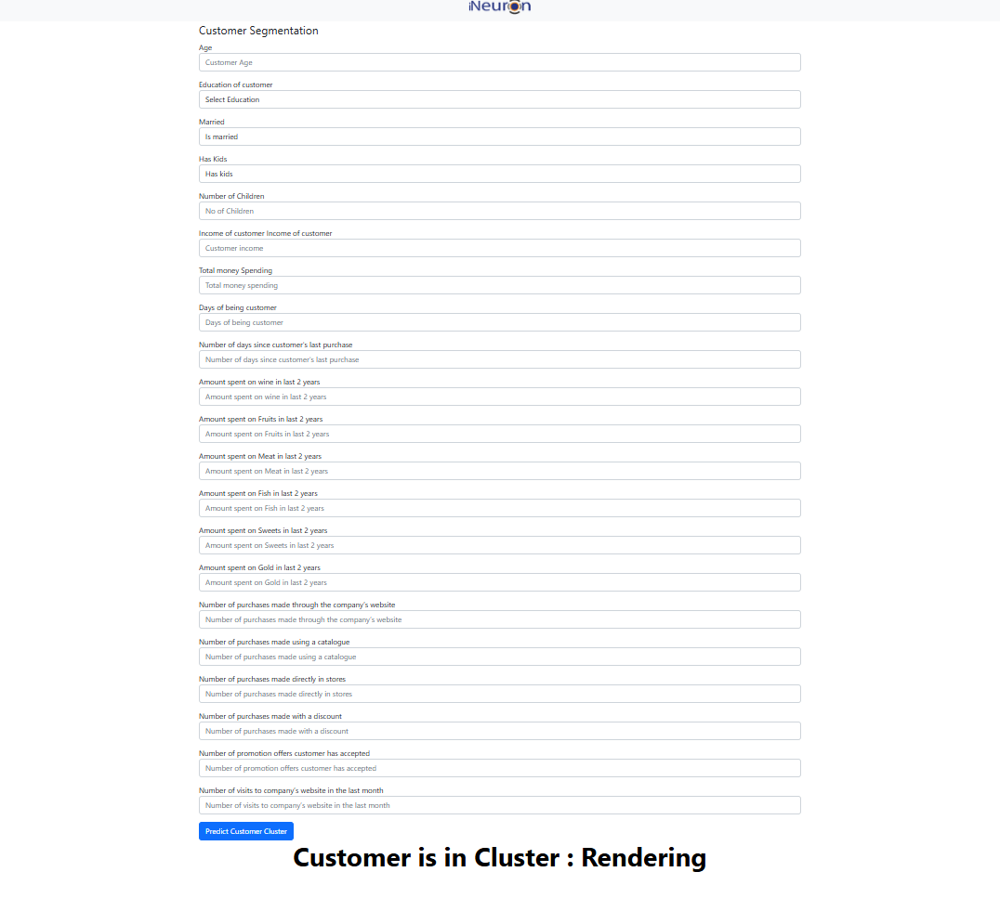

# Customer Personality Segmentation




## Problem Statement

In this data science project, I have built a machine learning system which can predict the personality of a customer using machine learning algorithms. This project will be very useful for malls, various stores, and product-based companies. Based on a customer's personal and purchase details, we can cluster them and predict the customer's cluster number using classification techniques.

## Solution Proposed

The question is: how can we dynamically predict the cluster of a new customer?

We use a machine learning-based approach, where we:
- Cluster existing customers based on their attributes
- Assign new customers to a cluster using classification techniques based on previously labeled data

### Dataset Used
[Click here to download](https://github.com/entbappy/Branching-tutorial/blob/master/marketing_campaign.zip)

---

## Tech Stack Used

- Python  
- FastAPI  
- Machine Learning (Scikit-learn)  
- Docker  
- MongoDB  

---

## Infrastructure Required

- AWS S3  
- Azure  
- GitHub Actions  

---

## How to Run the Project

> 💡 Before running, make sure you have a MongoDB Atlas account and have uploaded the dataset there.

### Step 1: Clone the repository

```

git clone [https://github.com/TanmaiSonwane/Customer-Segmentation/tree/main]

```

Step 2. Create a conda environment.

```

conda create --prefix venv python=3.11 -y

```

```

conda activate venv/

```

Step 3. Install the requirements

```

pip install -r requirements.txt

```

Step 4. Export the environment variable

```bash

export AWS_ACCESS_KEY_ID=<AWS_ACCESS_KEY_ID>


export AWS_SECRET_ACCESS_KEY=<AWS_SECRET_ACCESS_KEY>


export AWS_DEFAULT_REGION=<AWS_DEFAULT_REGION>


export MONGODB_URL= <MONGODB_URL>


```

Step 5. Run the application server

```

python app.py

```

Step 6. Train application

```bash

http://localhost:5000/train

```

Step 7. Prediction application

```bash

http://localhost:5000/predict

```

## Run locally

1. Check if the Dockerfile is available in the project directory
2. Build the Docker image

```

docker build --build-arg AWS_ACCESS_KEY_ID=<AWS_ACCESS_KEY_ID> --build-arg AWS_SECRET_ACCESS_KEY=<AWS_SECRET_ACCESS_KEY> --build-arg AWS_DEFAULT_REGION=<AWS_DEFAULT_REGION> --build-arg MONGODB_URL=<MONGODB_URL> . 

```

3. Run the Docker image

```

docker run -d -p 5000:5000 <IMAGE_NAME>

```

## Project Architecture -


## Data Collection Architecture -


## Deployment Architecture -


## Models Used

* [K-Means](https://www.javatpoint.com/k-means-clustering-algorithm-in-machine-learning)
* [LogisticRegression](https://scikit-learn.org/stable/modules/generated/sklearn.linear_model.LogisticRegression.html)

From these above models after hyperparameter optimization we selected these two models which were K-Means for clustering and Logistic Regression for classification and used the following in Pipeline.

* GridSearchCV is used for Hyperparameter Optimization in the pipeline.

## `src` is the main package folder which contains

**Components** : Contains all components of Machine Learning Project

- Data Ingestion
- Data Validation
- Data Transformation
- Data Clustering
- Model Trainer
- Model Evaluation
- Model Pusher
